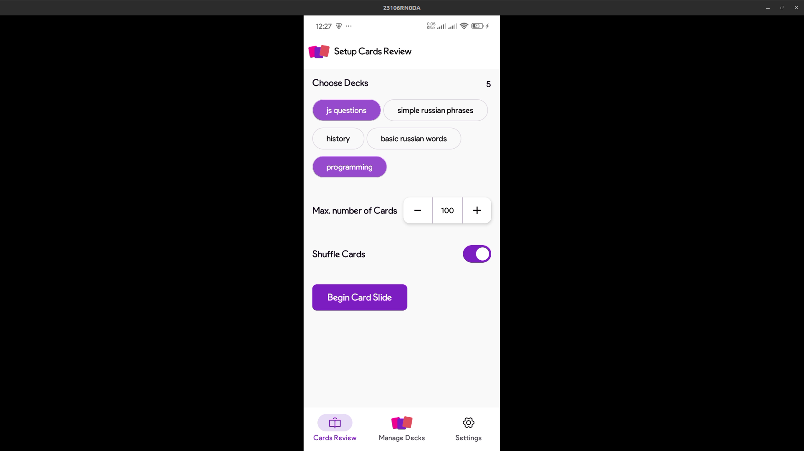
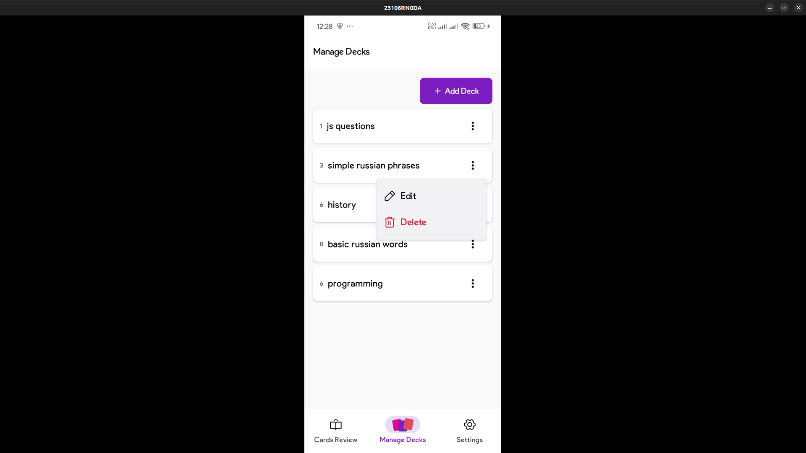
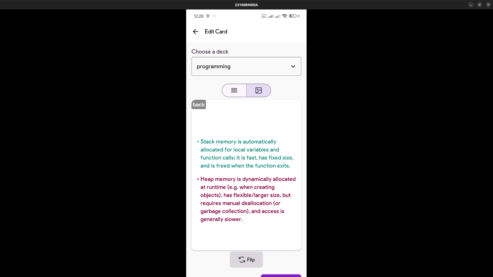
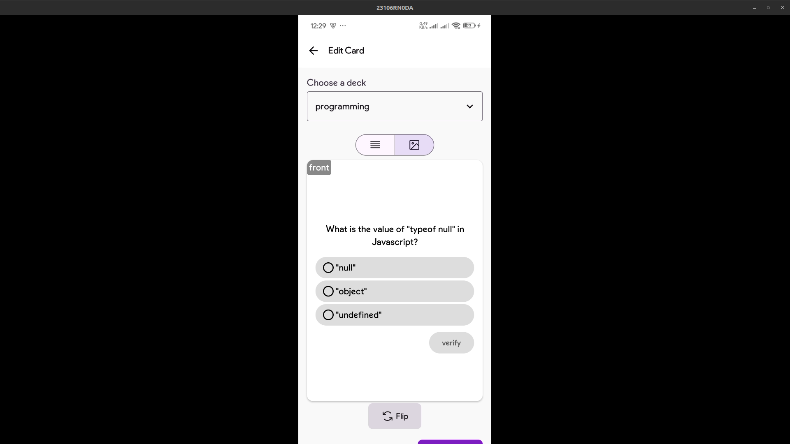

# Pamflet
Pamflet is a flashcard app that lets you create and study cards in a more engaging way. Using [pamflet dsl](https://github.com/craftzniac/pamflet-dsl-kotlin) (which is a tiny markup language), you can design:
- Regular text elements for straightforward notes
- Multiple-choice elements that let learners actively select answers and test their knowledge.
- Include links for additional resources

## Screenshots

## Demo

## Design files
[figma designs](https://www.figma.com/design/kgp32haxGJSxzSLAMUYO8Z/pamflet)

## Download android apk
Note: Only supports Android 7.0 or higher
[Download latest APK](https://github.com/craftzniac/pamflet-android/releases/download/v1.0/pamflet_v1.0.apk)

## How to run locally
For anyone who would like to run this app locally from source; 
- clone the repo
- open the app in Android Studio
- build the gradle project
